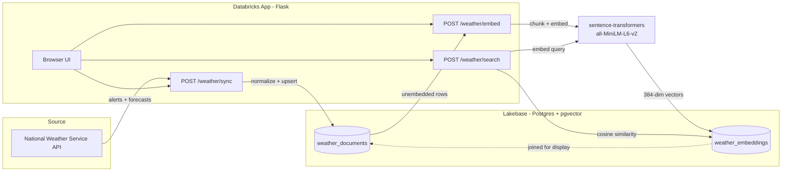

# Weather Intelligence Service

A Flask app that harvests real-time weather alerts and forecasts from the National Weather Service, converts them into vector embeddings, and serves them through a semantic search API — built on Databricks Apps with Lakebase (managed Postgres + pgvector).

Ask it something like *"flash flood risk this weekend"* and it returns the most semantically relevant weather documents, ranked by similarity — not keyword matching.

## What it does

1. **Harvest** — pulls active alerts and multi-day forecast narratives from `api.weather.gov` for tracked US cities (no API key required)
2. **Vectorize** — chunks the raw text and embeds it with `sentence-transformers/all-MiniLM-L6-v2` (384 dimensions)
3. **Search** — semantic search over the embedded documents using pgvector cosine similarity, with an optional filter by alert vs. forecast

All three steps are exposed as REST endpoints and driven from a small browser UI.

## Tools & stack

| Layer | Tool |
|---|---|
| Backend | Python, Flask |
| Data source | National Weather Service API (`api.weather.gov`) |
| Database | Databricks Lakebase (managed Postgres + pgvector extension) |
| Embeddings | `sentence-transformers` (`all-MiniLM-L6-v2`) |
| Auth | Databricks SDK, service-principal OAuth token generation |
| Hosting | Databricks Apps |
| Frontend | Plain HTML/CSS/JS (no framework), Flask `render_template` |

## Architecture



Auth flow: the app runs as a Databricks service principal, which requests a short-lived OAuth token (`w.postgres.generate_database_credential()`) on every database connection instead of using a static password.

## Problems hit & how they were solved

Building this surfaced a string of platform-specific gotchas that weren't obvious from the docs. Keeping this here for anyone who hits the same wall.

**1. `spark.write.jdbc` doesn't work against Lakebase**
Spark's JDBC writer isn't supported on this Postgres instance. Fixed by writing everything through `psycopg2` directly (`execute_values` with `%s::vector` casts for embedding columns) instead of Spark.

**2. Secret scope already exists errors**
`create_scope()` isn't idempotent — reran it on an existing scope and got `ResourceAlreadyExists`. Fixed by checking `list_scopes()` first, or just skipping creation and going straight to `put_secret()`, which *is* idempotent.

**3. `LAKEBASE_URL` never gets set — no such thing as one**
Assumed a Lakebase "Database" resource in Databricks Apps would inject a single connection string. It doesn't. It injects six separate variables instead: `PGHOST`, `PGPORT`, `PGDATABASE`, `PGUSER`, `PGSSLMODE`, `PGAPPNAME` — with **no password**. Auth is via a short-lived OAuth token fetched at connection time using the Databricks SDK (`w.postgres.generate_database_credential(endpoint=...)`), not a static secret.

**4. `permission denied for schema` / `must be owner of table`**
Created the schema/tables manually as a personal user first, then the app's service principal tried to write to them and got blocked — Postgres ties `CREATE INDEX` and DDL rights to the literal owner, and `GRANT ALL` doesn't cover ownership-level operations. Fixed by dropping the tables and letting the app's own `ensure_schema()` startup routine create them, so the service principal owns them from the start.

**5. Requests silently redirected to a Databricks login page**
Calling the deployed app's URL with a plain `requests.get()`/`.post()` (no auth) returned HTTP 200 — but the body was Databricks's own login page HTML, not the app's JSON. The app requires the caller to have an explicit **"Can Use" permission** grant on the App resource itself (separate from just being a logged-in workspace user). Fixed by adding the permission under the app's Permissions tab; after that, direct browser access and same-origin `fetch()` calls worked.

**6. `/healthz` always returns an empty 200**
Assumed this was a bug in the app. It isn't — `/healthz` is a path reserved by the Databricks Apps platform itself for its own infrastructure health checks, and never reaches the Flask app's own routes. Any other path (`/weather/sync`, etc.) hits real application code.

**7. `AttributeError: 'WorkspaceClient' object has no attribute 'postgres'`**
The `.postgres.generate_database_credential()` method only exists in `databricks-sdk >= 0.89.0`. Some cluster/notebook environments ship with an older pre-installed version. Fixed with `%pip install --upgrade databricks-sdk` followed by `dbutils.library.restartPython()` before importing anything that depends on it.

## Running it

```
POST /weather/sync    {"locations": ["Chicago, Illinois"], "limit": 50}
POST /weather/embed   {"limit": 500}
POST /weather/search  {"query": "flash flood risk this weekend", "top_k": 5, "source_type": null}
```

Or just open the app's base URL for the browser UI — sync, embed, and search buttons, no curl required.

See `README_WEATHER.md` for full schema details, chunking parameters, and known limitations.
